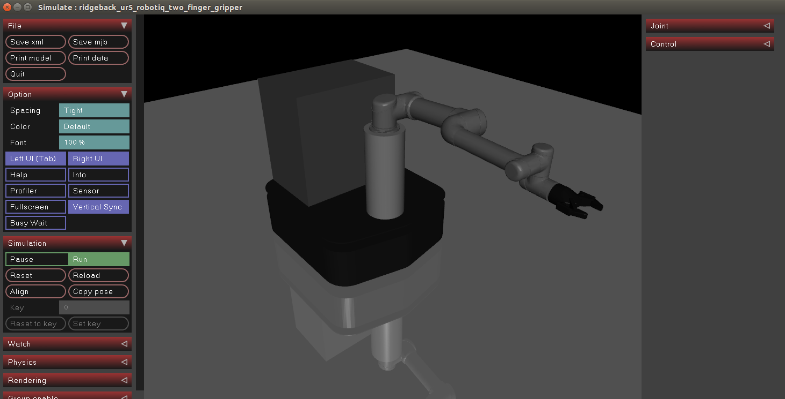

# MuJoCo UR5 Model



This is currently a planar robot only with three joints (two slide joints and a hinge joint). 

This repository includes:
- Required STL files to represent the shown robot.
- MuJoCo XML files to represent the robot in MuJoCo.
- A [Python script](scripts/set_ur5_joints.py) that will convert UR5 joint values
from degrees to MuJoCo body quaternions. An explanation about the need of this
script is available under [here](#description-about-the-robot-configuration).

## Developers and Contributors
MuJoCo UR5 Model was developed by the [Robot Manipulation Lab](https://artificial-intelligence.leeds.ac.uk/robot-manipulation/) in the School of Computing at the University of Leeds.
- Authors: [Rafael Papallas](http://rpapallas.com), [Wisdom Agboh](https://agboh.com) 
- Current maintainors: [Rafael Papallas](http://rpapallas.com), [Wisdom Agboh](https://agboh.com).

## License
This work is licensed under GNU General Public License v3.0. The full license is available [here](https://github.com/roboticsleeds/mujoco_ur5_model/blob/master/LICENSE). 

## Notes
### Description about the robot configuration

Since we meant to use this robot model as a planar robot, we decided to remove 
the arm joints and just add three joints on Ridgeback (x, y, theta).
Therefore, we had to apply some rotations to the bodies themselves to match the joint configuration of
the actual robot.

The current model in this repository as defined includes some custom configurations 
such that the arm is set to the following:
- **Base:** -90.0 degrees
- **Shoulder:** -175.0 degrees
- **Elbow:** -5.0 degrees
- **Wrist1:** -180.0 degrees
- **Wrist2:** -90.0 degrees
- **Wrist3:** -180.0 degrees

If you want to change the configuration of the robot, then we recommend to start from the following
original configuration of the arm (which is the home configuration of UR) and apply 
rotations as needed to the required bodies to match the UR5 joint values shown on
the screen. With the following configuration you should just apply the required
rotations of each joint from the UR5 screen to the existing quaternions of the
configuration below (multiply the current quaternion of the XML with the desired
rotation):
```xml
<body name="shoulder_link" pos="0.28 0 0.545159" quat="0.681998 0 0 -0.731354">
    <inertial pos="0 0 0" mass="3.7" diaginertia="0.0102675 0.0102675 0.00666" />
    <geom type="mesh" rgba="0.7 0.7 0.7 1" mesh="shoulder" />
    <body name="upper_arm_link" pos="0 0.13585 0" quat="0.707107 0 0.707107 0">
        <inertial pos="0 0 0.28" mass="8.393" diaginertia="0.226891 0.226891 0.0151074" />
        <geom type="mesh" rgba="0.7 0.7 0.7 1" mesh="upperarm" />
        <body name="forearm_link" pos="0 -0.1197 0.425">
            <inertial pos="0 0 0.25" mass="2.275" diaginertia="0.0494433 0.0494433 0.004095" />
            <geom type="mesh" rgba="0.7 0.7 0.7 1" mesh="forearm" />
            <body name="wrist_1_link" pos="0 0 0.39225" quat="0.707107 0 0.707107 0">
                <inertial pos="0 0 0" quat="0.5 0.5 -0.5 0.5" mass="1.219" diaginertia="0.21942 0.111173 0.111173" />
                <geom type="mesh" rgba="0.7 0.7 0.7 1" mesh="wrist1" />
                <body name="wrist_2_link" pos="0 0.093 0">
                    <inertial pos="0 0 0" quat="0.5 0.5 -0.5 0.5" mass="1.219" diaginertia="0.21942 0.111173 0.111173" />
                    <geom type="mesh" rgba="0.7 0.7 0.7 1" mesh="wrist2" />
                    <body name="wrist_3_link" pos="0 0 0.09465">
                        <inertial pos="0 0 0" quat="0.5 0.5 -0.5 0.5"  mass="0.1879" diaginertia="0.033822 0.0171365 0.0171365" />
                        <geom type="mesh" rgba="0.7 0.7 0.7 1" friction="0.8 0.8 0.8" mesh="wrist3" />
                    </body>
                </body>
            </body>
        </body>
    </body>
</body>
```

However, to make this easier, we wrote a simple Python script under `scripts` called
`set_ur5_joints.py` that will ask you to provide the joint values in degrees of the
robot as shown on the UR5 screen and the xml file you would like to modify and will
do the appropriate calculations and convertsions to set the model quaternions correctly.
